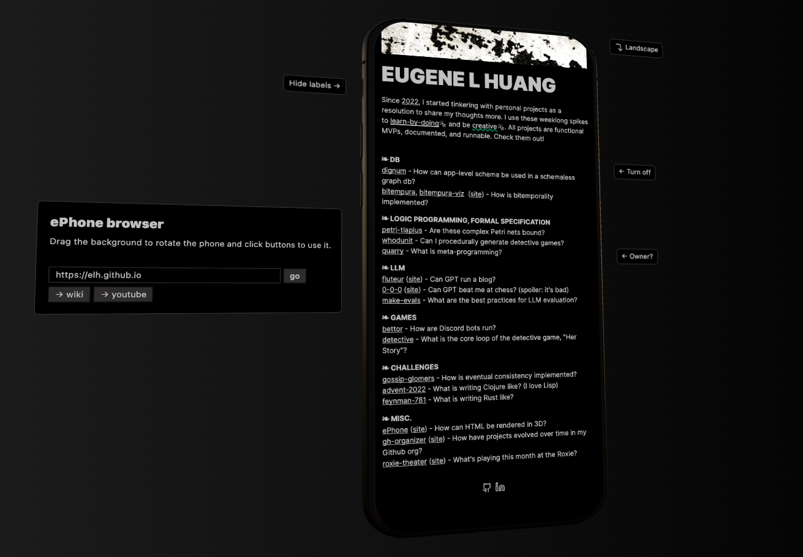

# ePhone - iframe a site onto a phone model

Use the info menu to navigate to a site. Flip phone orientation or drag the background to position the phone as desired. Some phone buttons are clickable.
* `url` query parameter can be used to specify the site to iframe.
* `landscape` query parameter can be used to rotate the phone. This works well with Youtube embeds.

Built with `@react-three/fiber`.

In the future, I want to make this a more involved 3D environment built around an iframe, but satisfied for a very quick hack and my first dabble with Three.js.

Shout out Sam Osborne for the [tutorial](https://www.youtube.com/watch?v=SQRqU3N3ehs). As of initial spike, the only additive things I had to do were figure out the positioning values for the model I wanted to use and add occlusion.

**TODO**
- [x] Add some info/help context (update: very basic)
- [x] Support landscape mode
- [ ] Manage link clicks inside iframe? Many sites will be blocked (Update: Mitigated this a bit on my own website)
- [ ] Add more of an environment. interactive?
- [ ] Make this a lib. Could be used as a goofy Youtube player
